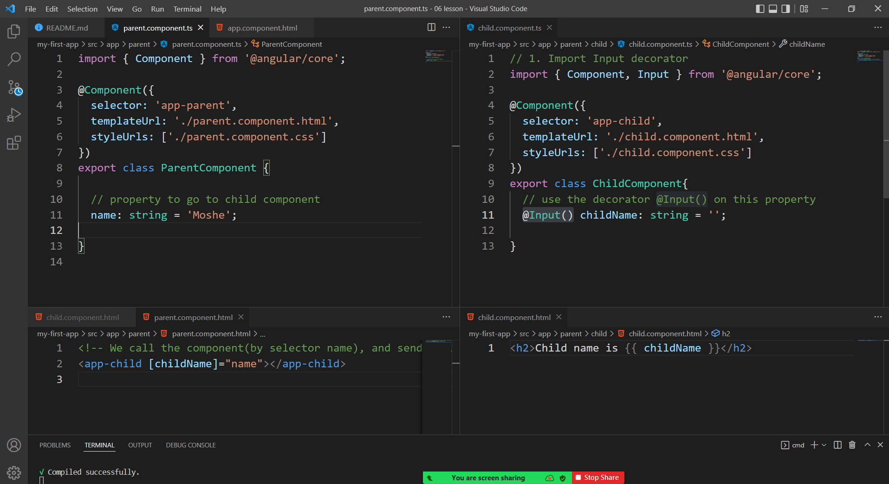

# @Input

- Input is a decorator `@Input()`

- Input allow us to share data between parent component and child component

- @Input decorator is similar to `props` in react

For example: Input will pass data from Fruit to Apple/Banana

```
Fruit
    * Apple
    * Banana
```

## Example:



- Run in terminal:

```
ng g c parent
ng g c parent/child
```

- child.component.ts

```ts
// 1. Import Input decorator
import { Component, Input } from "@angular/core";

@Component({
  selector: "app-child",
  templateUrl: "./child.component.html",
  styleUrls: ["./child.component.css"],
})
export class ChildComponent {
  // use the decorator @Input() on this property
  @Input() childName: string = "";
}
```

- child.component.html

```html
<h2>Child name is {{ childName }}</h2>
```

- parent.component.ts

```ts
import { Component } from "@angular/core";

@Component({
  selector: "app-parent",
  templateUrl: "./parent.component.html",
  styleUrls: ["./parent.component.css"],
})
export class ParentComponent {
  // property to go to child component
  name: string = "Moshe";
}
```

- parent.component.html

```html
<!-- We call the component(by selector name), and send Input -->
<app-child [childName]="name"></app-child>
```

- app.component.html

```html
<div class="container">
  <app-parent></app-parent>
</div>
```

## Class task

1. Create new component `city`
2. Create another component `city-details` - will be inside city component.

   ```
   ng g c city
   ng g c city/city-details
   ```

3. create in ts of `city-details` 5 properties with Input decorator:
   - Name
   - Country
   - Wheather
   - Area
   - Population
4. Use bootstrap to show the city details in a card in city-details.html
5. the properties will come from city.ts using Input.
6. Create in `city` component new file `city.ts` - with exported class - that has 5 parameters.
7. In city.ts - create array of 3 City objects, and insert data for 3 cities: Jerusalem, London, Paris.
8. In city.html - bring the city array 3 times - for each city.

## Goodluck!
