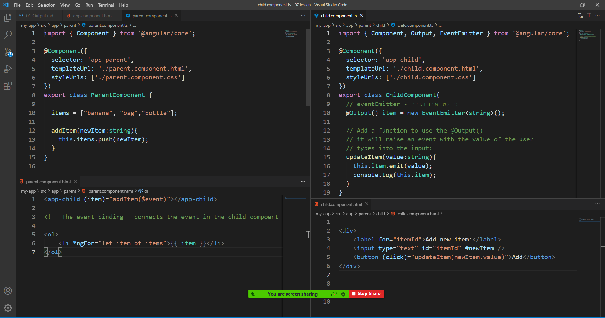

# Output

- `@Output()` - is a decorator function
- Allow us to send data from child component to parent component.


### Example:

- Create two components: parent-child:

```
ng g c parent
ng g c parent/child
```



##### child.component.ts

```ts
import { Component, Output, EventEmitter } from "@angular/core";

@Component({
  selector: "app-child",
  templateUrl: "./child.component.html",
  styleUrls: ["./child.component.css"],
})
export class ChildComponent {
  // eventEmitter - פולט אירועים
  @Output() item = new EventEmitter<string>();

  // Add a function to use the @Output()
  // it will raise an event with the value of the user
  // types into the input:
  updateItem(value: string) {
    this.item.emit(value);
    console.log(this.item);
  }
}
```

##### child.component.html

```html
<div>
  <label for="itemId">Add new item:</label>
  <input type="text" id="itemId" #newItem />
  <button (click)="updateItem(newItem.value)">Add</button>
</div>
```

##### parent.component.ts

```ts
import { Component } from "@angular/core";

@Component({
  selector: "app-parent",
  templateUrl: "./parent.component.html",
  styleUrls: ["./parent.component.css"],
})
export class ParentComponent {
  items = ["banana", "bag", "bottle"];

  addItem(newItem: string) {
    this.items.push(newItem);
  }
}
```

##### parent.component.html

```html
<app-child (item)="addItem($event)"></app-child>

<!-- The event binding - connects the event in the child compoent `item`  -->

<ol>
  <li *ngFor="let item of items">{{ item }}</li>
</ol>
```

## Class task:

- Create Angular app with 2 components
  - building
  - building/house
- Inside house.ts - create 3 variables of @Output()
  - houseNum
  - NumOfRooms
  - FamilyName
- Get all the values from the user using input.
  > note: use bootstrap.
- in building.ts - create an array of house objects.
- in building.html - call the house component,
  and get the new object from the house.
- Show the array of houses in a table.
