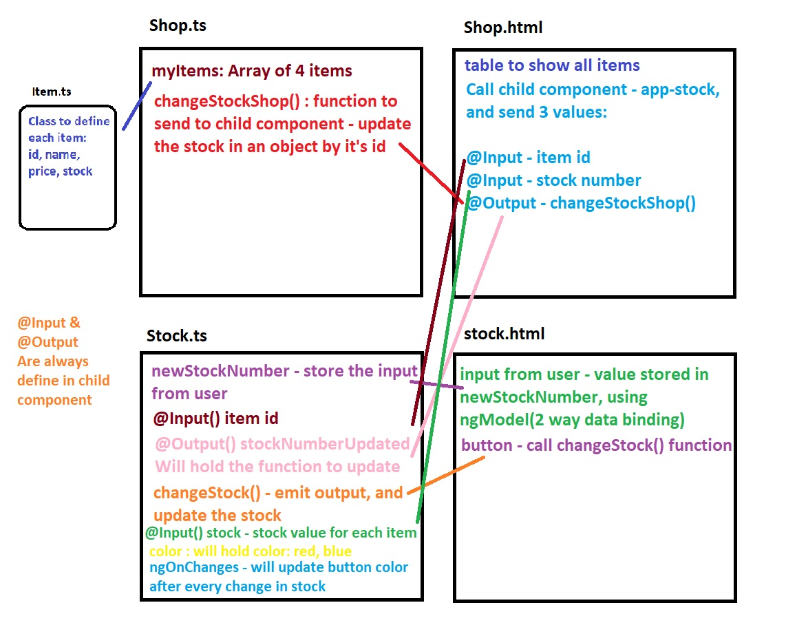

## Class task - Input, Output.

- Create 2 components: `shop`, `shop/stock`
- use bootstrap for design
- Create new file in shop folder `item.ts`, and export a structure class for each item:
  - id
  - name
  - price
  - stock
  
- In shop.ts - import the class, and create array of items objects with initial data. 

- in shop.html - create table to show the items.

- in stock.html - create input(to change stock's number) and button
- add to each row in the table input+button from stock.

- in stock.ts - create a function that will change the value of `stock`.
  use: Input, Output.

- use OnChanges interface in stock.ts - if stock > 30: button color will be blue. else - red.

#### Goodluck!

# Result



### important notes

All the use of `@Input()` and `@Output()` - happens in the child-component.
in parent.html when we call the child-component:
we will add the input & output values

- `@Input()` - `[]`. for example:

```html
<app-stock [itemId]="item.id"></app-stock>
```

- `@Output()` - `()`. for example:

```html
<app-stock (stockNumberUpdated)="changeStockShop($event)"></app-stock>
```
