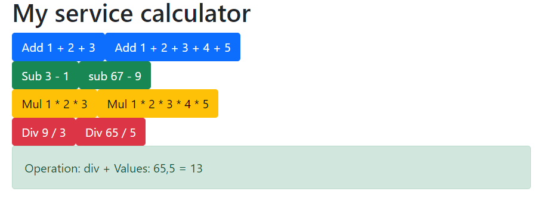

# Class task:

create in html  buttons: 2 for each function(in service)

  * add 
  * sub
  * mul
  * div

Each button will lead to a function is ts that call the 
service and return the result to HTML - in alert(boostrap). 

> Note: In each button - you can put any amount of numbers.


# Result:


## 1. calculator.service.ts
```ts
//  Injectable is an interface - metadata about the service
import { Injectable } from '@angular/core';

// Decorator that marks a class as available to be provided and injected as a dependency.
@Injectable({
  // One instance of the service shared across the app
  // If one component changes the data in service - everything is updated
  // in the entire app
  providedIn: 'root'
})

export class CalculatorService {

  constructor() { }

  public myName = 'Alex';

  // add(1, 2, 3), add(2, 3), add(5 ,6 ,7 4)
  add(...params:number[]):number{
    let res = 0;
    for (const value of params) res += value;
    return res;
  }

  sub(...params:number[]):number{
    let res =  params[0];
    for (let i = 1; i < params.length; i++) res -= params[i];
    return res;
  }

  mul(...params:number[]):number{
    let res = 1;
    for (const value of params) res *= value;
    return res;
  }

  div(...params:number[]):number{
    let res = params[0];
    for (let i = 1; i < params.length; i++) 
      res /= params[i];
    return res;
  }
}

```

## 2. app.component.html
```html
<div class="container">

    <h1>My service calculator</h1>

    <!-- Add -->
    <button (click)="func('add', [1, 2, 3])" class="btn btn-primary">
        Add 1 + 2 + 3</button>
    <button (click)="func('add', [1, 2, 3, 4, 5])" class="btn btn-primary">
        Add 1 + 2 + 3 + 4 + 5</button>

        <br/>

    <!-- Sub -->
    <button (click)="func('sub', [3, 1])" class="btn btn-success">
        Sub 3 - 1</button>
    <button (click)="func('sub', [67, 9])" class="btn btn-success">
        sub 67 - 9</button>

    <!-- Mul -->
    <br/>
    <button (click)="func('mul', [1, 2, 3])" class="btn btn-warning">
        Mul 1 * 2 * 3</button>
    <button (click)="func('mul', [1, 2, 3, 4, 5])" class="btn btn-warning">
        Mul 1 * 2 * 3 * 4 * 5</button>

        <br/>
    <!-- Div -->
    <button (click)="func('div', [9, 3])" class="btn btn-danger">
        Div 9 / 3</button>
    <button (click)="func('div', [65, 5])" class="btn btn-danger">
        Div 65 / 5</button>

    <div class="alert alert-success">{{ res }}</div>

</div>
```

## 3. app.component.ts
```ts
import { Component } from '@angular/core';
// 1. Import
import { CalculatorService } from './calculator.service';

@Component({
  selector: 'app-root',
  templateUrl: './app.component.html',
  styleUrls: ['./app.component.css']
})

export class AppComponent {

  public myService:CalculatorService;

  constructor(calc: CalculatorService){
    this.myService = calc;
  }

  public res:string = '';

  func(operation:string, values:number[]){
    this.res = `Operation: ${operation} + Values: ${values} = `
    switch (operation) {
      case 'add':
        this.res += this.myService.add(...values)
        break;
      case 'sub':
        this.res += this.myService.sub(...values)
          break;
      case 'mul':
        this.res += this.myService.mul(...values)
        break;
      case 'div':
        this.res += this.myService.div(...values)
          break;
    
      default:
        break;
    }
  }
}


```