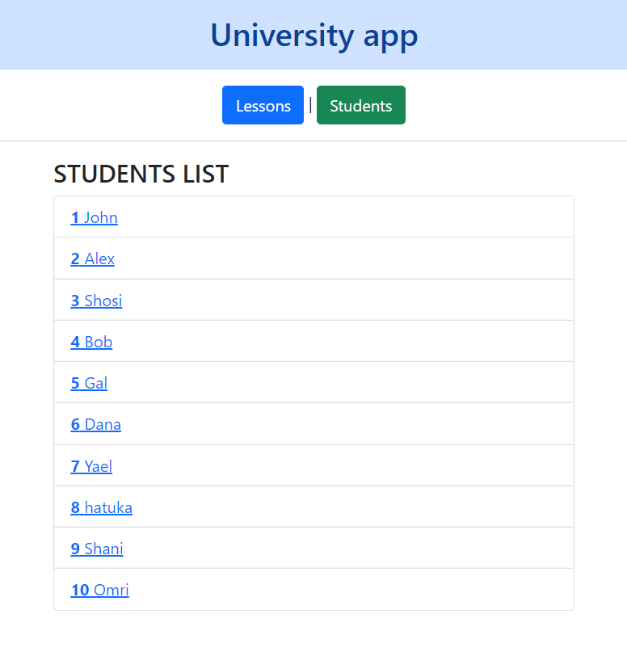

# Advanced routing




Explain modules in a simple way:
* main module - To show all buildings inside the university
* sub-modules - To show all the rooms inside each building..

Here: 
- Create more than 1 module
- Inside it - Create more than 1 router

### Create the app with routing options : yes

That will add new file for routing: `app-routing.module.ts`

## Add a component
```
ng g c lessons-list
```


## `app-routing.module.ts`

- Create an array of `Routes` - Represents a route configuration for the Router service. An array of Route objects.
- In imports: use the `RouterModule.forRoot(appRoutes)` with the array we created.
- RouterModule - Adds directives and providers for in-app navigation among views defined in an application.
- In exports: we export the `RouterModule` outside

```ts
import { NgModule } from "@angular/core";
import { CommonModule } from "@angular/common";
import { RouterModule, Routes } from "@angular/router";
import { LessonsListComponent } from "./lessons-list/lessons-list.component";

const appRoutes: Routes = [
  { path: "lessons", component: LessonsListComponent },
];

@NgModule({
  declarations: [],
  imports: [CommonModule, RouterModule.forRoot(appRoutes)],
  exports: [RouterModule],
})
export class AppRoutingModule {}
```

> note that in `app.module.ts` the router file is imported!

## 2. Create new Student module + router

- In CMD:

```
> ng g module students/students --module app --flat --routing

CREATE src/app/students/students-routing.module.ts (251 bytes)
CREATE src/app/students/students.module.ts (288 bytes)
UPDATE src/app/app.module.ts (833 bytes)
```

- Create new component inside `students` folder:

```
ng g c students/students-list
```

### 3. In StudentsRoutingModule
```js
import { NgModule } from '@angular/core';
import { RouterModule, Routes } from '@angular/router';
import { StudentsListComponent } from './students-list/students-list.component';

const routes: Routes = [
  {path:'students', component: StudentsListComponent}, 
];

@NgModule({
  imports: [RouterModule.forChild(routes)],
  exports: [RouterModule]
})
export class StudentsRoutingModule { }

```

#### In app.html

```html

<div>
  <h1 class="alert alert-primary text-center">University app</h1>
  
  <div class="text-center">
      <a class="btn btn-primary" routerLink="/lessons">Lessons</a> |
      <a class="btn btn-success" routerLink="/students">Students</a>
  </div>
</div>

<hr/>


<!-- Allow the app to use the routes from `app.module.ts` -->
<router-outlet></router-outlet>
```

#### student.ts

```ts
export default interface Student {
  id: number;
  name: string;
}
```

#### dummy-data-students.ts

```ts
import Student from "./student";

export const STUDENTS: Student[] = [
  { id: 1, name: "John" },
  { id: 2, name: "Bracha" },
  { id: 3, name: "Tomer" },
  { id: 4, name: "David" },
  { id: 5, name: "Hezi" },
  { id: 6, name: "Shmuel" },
  { id: 7, name: "Talat" },
  { id: 8, name: "Rachel" },
  { id: 9, name: "Dani" },
  { id: 10, name: "Guy" },
];
```

#### student.service.ts

```ts
import { Student } from "./student";
import { Injectable } from "@angular/core";
import { Observable, of } from "rxjs";
import { STUDENTS } from "./dummy-data-students";

@Injectable({
  providedIn: "root",
})
export class StudentService {
  constructor() {}

  getStudents(): Observable<Student[]> {
    return of(STUDENTS);
  }
}
```

#### students-list.ts

```ts
import { Component, OnInit } from "@angular/core";
import { Student } from "../student";
import { StudentService } from "../student.service";

@Component({
  selector: "app-students-list",
  templateUrl: "./students-list.component.html",
  styleUrls: ["./students-list.component.css"],
})
export class StudentsListComponent implements OnInit {
  // Array of students - get from service
  students: Student[] = [];

  // call the service in the ctor:
  constructor(private service: StudentService) {}

  // call the function when the class loaded.
  ngOnInit(): void {
    this.getStudents();
  }

  // this function will call the service function and put the data
  // from `dummy-data` in the students[] array.
  getStudents(): void {
    this.service
      .getStudents()
      .subscribe((students) => (this.students = students));
  }
}
```

#### students-list.html

```html
<div class="container">
  <h3>STUDENTS LIST</h3>
  <ul class="list-group">
    <li *ngFor="let student of students" class="list-group-item">
      <b> {{ student.id }} </b> {{ student.name }}
    </li>
  </ul>
</div>
```

#### 3. Update modules:

- Create new component `ng g c students/student-detail`

#### Update routing - students-routing.module.ts

- Define the `students` routing here.
- Define new route with parameters - StudentDetailComponent

```ts
import { NgModule } from "@angular/core";
import { RouterModule, Routes } from "@angular/router";
import { StudentDetailComponent } from "./student-detail/student-detail.component";
import { StudentsListComponent } from "./students-list/students-list.component";

const routes: Routes = [
  { path: "students", component: StudentsListComponent },
//   With params
  { path: "student/:id", component: StudentDetailComponent },
];

@NgModule({
  imports: [RouterModule.forChild(routes)],
  exports: [RouterModule],
})
export class StudentsRoutingModule {}
```

## Add params routing:

#### students-list.ts

```ts
import { Observable } from "rxjs";
import { Component, OnInit } from "@angular/core";
import { Student } from "../student";
import { StudentService } from "../student.service";
import { ActivatedRoute } from "@angular/router";
import { switchMap } from "rxjs/operators";

@Component({
  selector: "app-students-list",
  templateUrl: "./students-list.component.html",
  styleUrls: ["./students-list.component.css"],
})
export class StudentsListComponent implements OnInit {
  students: Observable<Student[]>;
  selectedId = 0;

  constructor(private service: StudentService, private route: ActivatedRoute) {}

  // paramMap - An Observable that contains a map of the required and optional parameters specific to the route.
  // pipe() - is a function that will chain functions before executing.
  // params.get() - Retrieves a single value for a parameter.
  ngOnInit(): void {
    this.students = this.route.paramMap.pipe(
      switchMap((params) => {
        this.selectedId = parseInt(params.get("id"));
        return this.service.getStudents();
      })
    );
  }
}
```

#### students-list.html

```html

<div class="container">
    <h3>STUDENTS LIST</h3>
  
    <ul class="list-group">
        <!-- Add async pipe for students array(it is an observable) -->
        <li *ngFor="let student of students | async" class="list-group-item">
            <!-- localhost:4200/student/:id -->
            <a [routerLink]="['/student', student.id ]">
                <b>{{ student.id }}</b> {{ student.name }}
            </a>
        </li>
    </ul>
</div>
```

#### Update the `student.service.ts`

```ts
import { Student } from "./student";
import { Injectable } from "@angular/core";
import { Observable, of } from "rxjs";
import { STUDENTS } from "./dummy-data-students";
import { map } from "rxjs/operators";

@Injectable({
  providedIn: "root",
})
export class StudentService {
  constructor() {}

  getStudents(): Observable<Student[]> {
    return of(STUDENTS);
  }

  getStudent(id: number | string) {
    return this.getStudents().pipe(
      // + - before `id` - turns a string into a number
      map((student: Student[]) => student.find((s) => s.id === +id)!)
    );
  }
}
```

#### student-detail.ts

```ts
import { Observable } from "rxjs";
import { Student } from "./../student";
import { Component, OnInit } from "@angular/core";
import { ActivatedRoute, ParamMap, Router } from "@angular/router";
import { StudentService } from "../student.service";
import { switchMap } from "rxjs/operators";

@Component({
  selector: "app-student-detail",
  templateUrl: "./student-detail.component.html",
  styleUrls: ["./student-detail.component.css"],
})
export class StudentDetailComponent implements OnInit {
  // get one student from the array
  student: Observable<Student>;

  // Get all services and interfaces to work with:
  constructor(
    private route: ActivatedRoute,
    private router: Router,
    private service: StudentService
  ) {}

  ngOnInit(): void {
    this.student = this.route.paramMap.pipe(
      switchMap((params: ParamMap) => this.service.getStudent(params.get("id")))
    );
  }

  goBack() {
    // const sId = student ? student.id : null;
    // this.router.navigate(['/students', { id: sId }]);
    this.router.navigate(["/students"]);
  }
}
```

#### student-detail.html

```html
<div class="container">
  <h2>Student - details</h2>
  <div *ngIf="student | async as student">
    <h3>{{ student.name }}</h3>
    <b>ID: </b> {{ student.id }}
    <div>
      <label>Name:</label>
      <input type="text" [(ngModel)]="student.name" placeholder="name..." />
    </div>

    <button class="btn btn-secondary" (click)="goBack()">BACK</button>
  </div>
</div>
```
